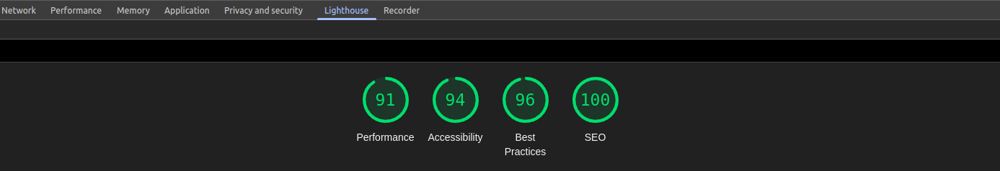
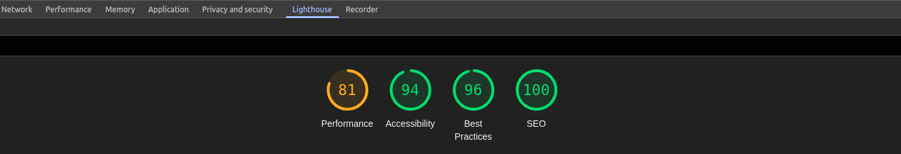

## 👨💻 Author

**Nassim Khelifi**  
- LinkedIn: [Nassim khelifi](https://www.linkedin.com/in/khelifi-nassim/)  
  
# Croonus App

##The LightHouse Test Results for Home Page:



##The LightHouse Test Results for Blog Page:



## Folder Structure
```
   └── 📁public
        └── File.svg
        └── 📁images
            └── image.image
        └── 📁videos
            └── Video.Video
    └── 📁src
        └── 📁app
            └── 📁page
                └── page.css
                └── page.js
            └── 📁Components
                └── 📁Components
                    └── 📁Components.css
                    └── 📁Components.js
                    └── index.js
            └── 📁CustomHooks
                └── CustomHooks.js
            └── 📁MediaReaders
                └── 📁MediaReaders
                    └── index.js
                    └── MediaReaders.css
                    └── MediaReaders.js
            └── 📁Shared
                └── 📁Shared
                    └── Shared.css
                    └── Shared.js
                    └── index.js
            └── globals.css
            └── layout.js
            └── page.js
    └── .gitignore
    └── eslint.config.mjs
    └── jsconfig.json
    └── next.config.mjs
    └── package-lock.json
    └── package.json
    └── postcss.config.mjs
    └── README.md
```